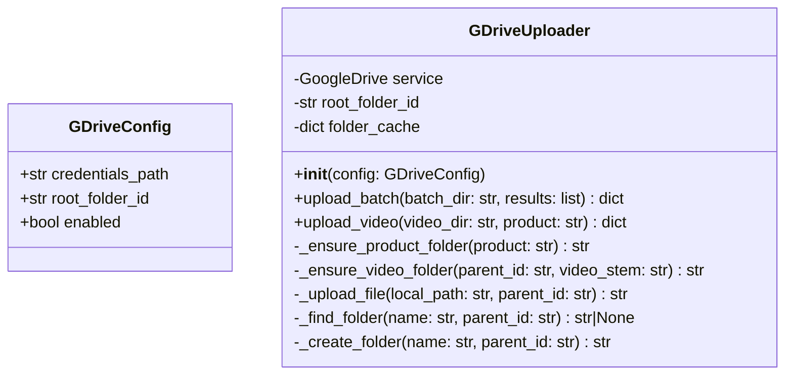
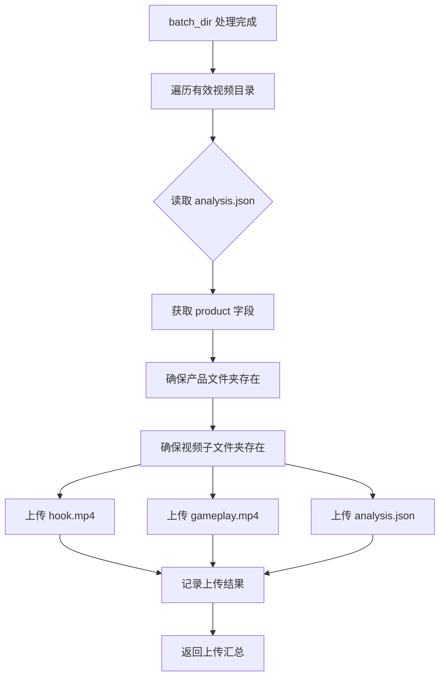

# Google Drive 自动上传模块设计方案

## 概述

将处理后的视频素材（hook.mp4 / gameplay.mp4 / analysis.json）自动上传至指定 Google Drive 文件夹，按产品名称分目录组织。

## 认证方式

使用 **Service Account**（服务账号）认证：
- 凭据文件：JSON 格式的服务账号密钥（`credentials.json`）
- 前提：目标 Google Drive 文件夹需共享给服务账号邮箱
- 依赖：`google-api-python-client` + `google-auth`

## Google Drive 文件夹结构

```
[目标文件夹] (GDRIVE_ROOT_FOLDER_ID)
├── Arrow Maze - Escape Puzzle/
│   ├── 58acfd1090e646678b92c7e41fcaface/
│   │   ├── hook.mp4
│   │   ├── gameplay.mp4
│   │   └── analysis.json
│   └── ab1133ac9c54e0d35fe0fd8eaed5de63/
│       ├── hook.mp4
│       ├── gameplay.mp4
│       └── analysis.json
├── Arrowscapes™ - Arrows Puzzle/
│   └── 0a9be9a96041a462dbf06e0cd2db0043/
│       ├── hook.mp4
│       ├── gameplay.mp4
│       └── analysis.json
└── ...
```

## 模块设计

### 新增文件：`src/gdrive_uploader.py`



### 核心流程



### 关键设计决策

1. **文件夹缓存**：`folder_cache` 避免重复查询/创建同名文件夹
2. **幂等上传**：同名文件已存在时覆盖（通过先查询 file_id 再 update）
3. **断点续传**：大文件使用 `MediaIoBaseUpload` 的 resumable 模式
4. **错误处理**：单个文件上传失败不影响其他文件，记录错误继续

### 配置项（添加到 Config）

| 配置项 | 环境变量 | 默认值 | 说明 |
|--------|----------|--------|------|
| `gdrive_enabled` | `GDRIVE_ENABLED` | `False` | 是否启用上传 |
| `gdrive_credentials_path` | `GDRIVE_CREDENTIALS_PATH` | `credentials.json` | 服务账号密钥文件路径 |
| `gdrive_root_folder_id` | `GDRIVE_ROOT_FOLDER_ID` | | 目标文件夹 ID |

### 命令行参数

```
--gdrive                  启用 Google Drive 上传
--gdrive-folder ID        指定目标文件夹 ID
--gdrive-creds PATH       指定凭据文件路径
```

### 集成点

在 `main.py` 的 `process_videos_serial()` / `process_videos_parallel()` 完成后，调用上传：

```python
# main.py 末尾
if config.gdrive_enabled:
    from .gdrive_uploader import GDriveUploader
    uploader = GDriveUploader(config)
    upload_results = uploader.upload_batch(config.batch_dir, results)
    logger.info(f"Google Drive 上传完成: {upload_results['uploaded']} 成功, {upload_results['failed']} 失败")
```

## 依赖

```
# requirements.txt 新增
google-api-python-client>=2.0.0
google-auth>=2.0.0
google-auth-httplib2>=0.1.0
```

## 使用步骤

1. 将服务账号密钥文件保存为 `credentials.json`
2. 在 Google Drive 中创建目标文件夹，将文件夹共享给服务账号邮箱
3. 获取文件夹 ID（URL 中 `folders/` 后的字符串）
4. 配置 `.env`：
   ```
   GDRIVE_ENABLED=True
   GDRIVE_CREDENTIALS_PATH=credentials.json
   GDRIVE_ROOT_FOLDER_ID=1aBcDeFgHiJkLmNoPqRsTuVwXyZ
   ```
5. 运行：
   ```bash
   python -m src.main --gdrive --gdrive-folder 1aBcDeFgHiJkLmNoPqRsTuVwXyZ
   ```
