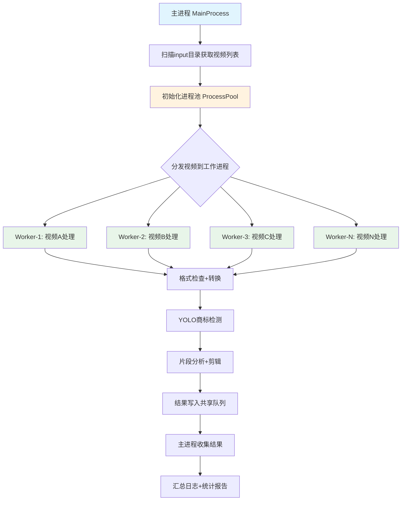
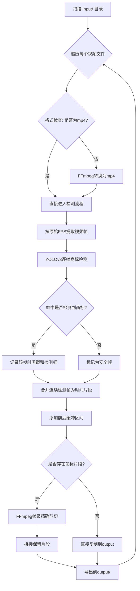
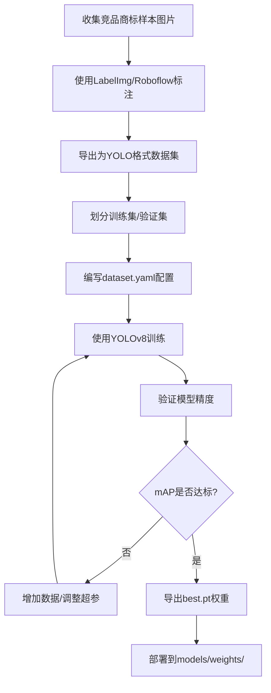

# 竞品商标视频剪辑工作流 - 实现方案

## 1. 项目概述

构建一个自动化视频处理工作流，用于识别并剪除竞品广告素材中包含竞品商标的视频片段，输出干净的广告素材。

**核心需求：**
- 读取 `input/` 文件夹中的视频
- 非mp4格式自动转换为mp4
- 使用 YOLO 视觉识别框架检测竞品商标
- 帧级精确剪除包含商标的片段
- 导出剪辑后的视频到 `output/` 文件夹
- 多进程并行处理，加速批量视频处理

---

## 2. 技术选型

| 模块 | 技术方案 | 说明 |
|------|---------|------|
| 编程语言 | Python 3.10+ | ML/视频处理生态最完善 |
| 视频格式转换 | FFmpeg + ffmpeg-python | 工业级视频处理，支持流复制避免重编码 |
| 商标检测 | Ultralytics YOLOv8 | 最新YOLO版本，训练简单，推理速度快 |
| 帧提取 | OpenCV | 高效视频帧读取 |
| 视频剪辑 | FFmpeg | 帧级精确剪切，支持无损拼接 |
| 并行处理 | Python multiprocessing | 多进程并行处理视频，绕过GIL限制 |
| 数据标注 | LabelImg / Roboflow | YOLO格式标注工具 |
| 模型训练 | Ultralytics API | 内置训练/验证/导出流程 |

---

## 3. 系统架构

### 3.1 项目目录结构

```
Videoprecut/
├── input/                        # 输入视频目录
├── output/                       # 输出视频目录
├── trademarks/                   # 竞品商标样本图片
│   └── README.md                 # 商标样本说明
├── models/
│   ├── dataset/                  # YOLO训练数据集
│   │   ├── images/
│   │   │   ├── train/
│   │   │   └── val/
│   │   ├── labels/
│   │   │   ├── train/
│   │   │   └── val/
│   │   └── dataset.yaml           # YOLO数据集配置
│   └── weights/                   # 训练好的模型权重
│       └── best.pt
├── src/
│   ├── __init__.py
│   ├── main.py                    # 主入口 - 工作流编排
│   ├── config.py                  # 全局配置
│   ├── ingestion.py               # 视频读取与格式检查
│   ├── converter.py               # 视频格式转换
│   ├── detector.py                # YOLO商标检测
│   ├── segmenter.py               # 商标片段分析与合并
│   ├── editor.py                  # 视频剪辑与拼接
│   ├── parallel.py                # 多进程并行处理
│   ├── trainer.py                 # YOLO模型训练脚本
│   └── utils.py                   # 工具函数
├── logs/                          # 处理日志
├── requirements.txt
├── setup.py
└── README.md
```

### 3.2 并行处理架构图



**关键设计：**
- 主进程负责扫描、分发、收集结果
- 每个工作进程独立处理一个完整视频（格式转换→检测→剪辑→导出）
- YOLO模型在每个工作进程中独立加载（避免多进程共享GPU模型冲突）
- 使用 `multiprocessing.Queue` 收集处理结果和日志
- 使用 `multiprocessing.Manager` 共享全局状态（如进度计数器）

### 3.3 处理流程图



### 3.4 YOLO训练流程图



---

## 4. 模块详细设计

### 4.1 配置模块 - `config.py`

```python
# 关键配置项
class Config:
    # 路径配置
    INPUT_DIR = "input"
    OUTPUT_DIR = "output"
    MODEL_WEIGHTS = "models/weights/best.pt"
    TRADEMARK_DIR = "trademarks"
    
    # 检测配置
    CONFIDENCE_THRESHOLD = 0.5    # YOLO检测置信度阈值
    IOU_THRESHOLD = 0.45         # NMS的IoU阈值
    
    # 剪辑配置
    BUFFER_BEFORE_SEC = 0.3      # 商标片段前缓冲时长(秒)
    BUFFER_AFTER_SEC = 0.3       # 商标片段后缓冲时长(秒)
    MIN_SEGMENT_SEC = 0.1       # 最小商标片段时长(秒)，低于此值忽略
    FRAME_SAMPLE_RATE = 1       # 帧采样率(1=每帧检测,2=隔帧检测...)
    
    # 转换配置
    VIDEO_CODEC = "libx264"     # 输出视频编码
    AUDIO_CODEC = "aac"         # 输出音频编码
    CRF = 18                    # 恒定质量因子(0-51,越小质量越高)
    
    # 硬件配置
    DEVICE = "0"                # GPU设备号, "cpu"表示使用CPU
    BATCH_SIZE = 16             # YOLO推理批大小
    
    # 并行配置
    MAX_WORKERS = 4             # 最大并行工作进程数
    USE_PARALLEL = True         # 是否启用并行处理
    GPU_IDS = [0]              # 可用GPU列表，多GPU时自动分配
```

### 4.2 视频读取模块 - `ingestion.py`

**职责：** 扫描输入目录，识别视频文件，获取视频元信息

- 扫描 `input/` 目录下所有文件
- 通过文件扩展名判断视频类型（支持: mp4, webm, avi, mov, mkv, flv）
- 使用 OpenCV/FFprobe 获取视频元信息（时长、FPS、分辨率、编码格式）
- 返回视频信息列表

### 4.3 格式转换模块 - `converter.py`

**职责：** 将非mp4格式视频转换为mp4

- 检测视频格式，mp4直接跳过
- 使用 FFmpeg 进行格式转换，关键参数：
  - 视频编码：`libx264`（H.264，兼容性最佳）
  - 音频编码：`aac`
  - CRF 质量控制：18（高质量）
  - preset：`medium`（平衡速度与质量）
- 转换后验证输出文件完整性
- 转换后的mp4保存到临时目录，供后续流程使用

### 4.4 商标检测模块 - `detector.py`

**职责：** 使用 YOLOv8 对视频帧进行商标检测

**核心流程：**
1. 加载训练好的 YOLOv8 模型权重
2. 使用 OpenCV 逐帧读取视频
3. 按 `FRAME_SAMPLE_RATE` 采样帧送入 YOLO
4. 收集检测结果（帧号、时间戳、检测框、置信度）
5. 返回检测结果列表

**优化策略：**
- 批量推理：将多帧组成batch送入模型，提高GPU利用率
- 采样检测：可配置隔帧检测，未检测帧沿用相邻帧结果
- 半精度推理：使用FP16加速推理（GPU模式）

### 4.5 片段分析模块 - `segmenter.py`

**职责：** 将逐帧检测结果合并为连续的时间片段

**核心算法：**
1. 将检测到商标的帧按时间排序
2. 合并连续帧为片段：如果相邻两帧间隔小于阈值，归为同一片段
3. 对每个片段添加前后缓冲区间
4. 过滤掉时长小于 `MIN_SEGMENT_SEC` 的片段
5. 计算需要保留的片段（即商标片段的补集）
6. 返回保留片段的时间列表

**示例：**
```
原始视频: 0──────────────────────────────60s
检测到商标: 5.0-5.5s, 20.2-21.8s, 45.0-46.2s
添加缓冲: 4.7-5.8s, 19.9-22.1s, 44.7-46.5s
保留片段: 0-4.7s, 5.8-19.9s, 22.1-44.7s, 46.5-60s
```

### 4.6 视频剪辑模块 - `editor.py`

**职责：** 根据保留片段列表，使用 FFmpeg 精确剪切并拼接视频

**剪辑策略 - FFmpeg 精确剪切：**
1. 对每个保留片段，使用 FFmpeg 的 `-ss` 和 `-to` 参数精确剪切
2. 使用 `-c copy` 进行流复制（无损、快速），如果关键帧对齐则无需重编码
3. 如果流复制导致精度问题，回退到重编码模式（`-c:v libx264`）
4. 将所有保留片段拼接为最终视频

**拼接方式：**
- 方案A：使用 FFmpeg concat demuxer（需要先导出各片段为临时文件）
- 方案B：使用 FFmpeg filter_complex 的 concat 滤镜（单命令完成，推荐）

**音频处理：**
- 同步剪切音频轨道
- 确保音视频同步

### 4.7 模型训练模块 - `trainer.py`

**职责：** 提供 YOLOv8 模型训练脚本

**训练流程：**
1. 准备数据集：从商标样本图片中标注训练数据
2. 配置 `dataset.yaml`：
   ```yaml
   path: models/dataset
   train: images/train
   val: images/val
   names:
     0: trademark_a
     1: trademark_b
     2: trademark_c
   ```
3. 训练命令：
   ```python
   from ultralytics import YOLO
   model = YOLO('yolov8n.pt')  # 从预训练权重开始
   model.train(data='models/dataset/dataset.yaml', epochs=100, imgsz=640, batch=16)
   ```
4. 验证并导出最佳权重

**数据增强建议：**
- 随机缩放、旋转、色彩抖动（YOLOv8内置）
- 模拟视频中的运动模糊效果
- 添加不同背景下的商标图片
- 考虑商标在视频中的不同尺寸和角度

### 4.8 多进程并行模块 - `parallel.py`

**职责：** 管理多进程并行处理视频

**核心设计：**

```python
# 伪代码
import multiprocessing as mp
from functools import partial

def worker(video_path, config_dict, result_queue, progress_counter, gpu_id):
    """单个工作进程：处理一个完整视频"""
    # 1. 在当前进程中加载YOLO模型（每个进程独立加载）
    config = Config.from_dict(config_dict)
    config.DEVICE = str(gpu_id)  # 绑定到指定GPU
    
    try:
        result = process_video(video_path, config)
        result_queue.put(("success", video_path, result))
    except Exception as e:
        result_queue.put(("error", video_path, str(e)))
    finally:
        with progress_counter.get_lock():
            progress_counter.value += 1

def run_parallel(videos, config):
    """并行处理入口"""
    result_queue = mp.Queue()
    progress_counter = mp.Value("i", 0)
    
    # GPU分配策略：轮询分配可用GPU
    gpu_assignments = [config.GPU_IDS[i % len(config.GPU_IDS)] 
                       for i in range(len(videos))]
    
    # 创建进程池
    worker_func = partial(worker, 
                           config_dict=config.to_dict(),
                           result_queue=result_queue,
                           progress_counter=progress_counter)
    
    with mp.Pool(processes=config.MAX_WORKERS) as pool:
        pool.starmap(worker_func, 
                     [(v, gpu_assignments[i]) for i, v in enumerate(videos)])
    
    # 收集所有结果
    results = []
    while not result_queue.empty():
        results.append(result_queue.get())
    
    return results
```

**GPU分配策略：**
- 单GPU场景：所有工作进程共享同一GPU，通过CUDA自动排队
- 多GPU场景：轮询分配GPU给工作进程，均衡负载
- CPU模式：`gpu_id = "cpu"`，受CPU核心数限制

**进程数配置建议：**

| 硬件环境 | MAX_WORKERS建议 | 说明 |
|---------|---------------|------|
| 1 GPU + 4核CPU | 2-3 | GPU是瓶颈，过多进程会争抢GPU |
| 1 GPU + 8核CPU | 3-4 | FFmpeg编码可利用空闲CPU |
| 2 GPU + 8核CPU | 4-6 | 每GPU分配2-3个进程 |
| 纯CPU模式 | CPU核心数-1 | 留1核给主进程 |

**注意事项：**
- YOLO模型在每个工作进程中独立加载，内存占用 = 模型大小 × 工作进程数
- FFmpeg进程由各工作进程独立调用，无共享冲突
- 输出目录写入需要确保文件名不冲突（使用源文件名作为输出名）
- 临时文件目录按进程ID隔离，避免冲突

### 4.9 主入口模块 - `main.py`

**职责：** 编排整个工作流，支持串行和并行两种模式

```python
# 伪代码
def process_video(video_path, config):
    """处理单个视频的完整流程"""
    # 1. 格式检查与转换
    mp4_path = ensure_mp4(video_path, config)
    
    # 2. 商标检测
    detections = detect_trademarks(mp4_path, config)
    
    # 3. 片段分析
    keep_segments = analyze_segments(detections, video_info, config)
    
    # 4. 视频剪辑
    if len(keep_segments) == 1 and keep_segments[0].is_full_video():
        # 无商标，直接复制
        copy_to_output(mp4_path, config.OUTPUT_DIR)
    else:
        # 剪辑并拼接
        edit_video(mp4_path, keep_segments, config.OUTPUT_DIR, config)
    
    # 5. 清理临时文件
    cleanup_temp_files()

def main():
    config = Config()
    videos = scan_input_dir(config.INPUT_DIR)
    
    if config.USE_PARALLEL and len(videos) > 1:
        # 并行模式
        results = run_parallel(videos, config)
        summarize_results(results)
    else:
        # 串行模式（单视频或禁用并行）
        for video in videos:
            process_video(video, config)
```

---

## 5. 关键技术细节

### 5.1 帧级精确剪辑实现

FFmpeg 精确剪切的关键在于关键帧对齐：

```
# 方案1: 流复制（快速，但可能不精确）
ffmpeg -i input.mp4 -ss 00:00:05.800 -to 00:00:19.900 -c copy segment1.mp4

# 方案2: 重编码（精确，但较慢）
ffmpeg -i input.mp4 -ss 00:00:05.800 -to 00:00:19.900 -c:v libx264 -c:a aac segment1.mp4

# 推荐: 先seek再重编码（兼顾速度和精度）
ffmpeg -ss 00:00:05.800 -i input.mp4 -to 00:00:14.100 -c:v libx264 -c:a aac -crf 18 segment1.mp4
```

**拼接命令：**
```
# 创建concat文件
echo "file 'segment1.mp4'" > concat.txt
echo "file 'segment2.mp4'" >> concat.txt

# 拼接
ffmpeg -f concat -safe 0 -i concat.txt -c copy output.mp4
```

### 5.2 YOLO检测优化

- **模型选择**：推荐 YOLOv8n（nano）或 YOLOv8s（small），商标检测任务相对简单，小模型即可
- **推理加速**：使用 TensorRT 导出可大幅提升推理速度
- **批量处理**：将视频帧组成batch送入模型
- **ROI限制**：如果商标只出现在视频特定区域，可裁剪ROI减少计算量

### 5.3 音视频同步

剪辑时必须确保音视频同步：
- 使用 `-vsync cfr` 确保固定帧率
- 剪切点对齐到音频采样点
- 拼接时确保所有片段编码参数一致

### 5.4 多进程并行优化

- **模型加载策略**：每个Worker进程启动时独立加载YOLO模型，避免进程间共享模型带来的GPU内存冲突
- **内存管理**：监控每个Worker的内存占用，防止OOM；可通过 `psutil` 动态调整Worker数量
- **错误隔离**：单个视频处理失败不影响其他视频，错误信息通过Queue传回主进程
- **进度追踪**：使用共享计数器 + tqdm 实时显示整体进度
- **临时文件隔离**：每个Worker使用独立临时目录（`/tmp/videoprecut_{pid}/`），避免文件冲突

---

## 6. 依赖清单

```
# requirements.txt
ultralytics>=8.0.0      # YOLOv8
opencv-python>=4.8.0     # 视频帧读取
ffmpeg-python>=0.2.0    # FFmpeg Python绑定
Pillow>=10.0.0          # 图像处理
tqdm>=4.65.0            # 进度条
pyyaml>=6.0             # YAML配置
psutil>=5.9.0           # 系统资源监控（CPU/内存/GPU利用率）
```

**系统依赖：**
- FFmpeg >= 6.0（需系统安装）
- CUDA >= 11.8（GPU推理，可选）

---

## 7. 使用流程

### 7.1 首次使用 - 模型训练

```bash
# 1. 将商标样本图片放入 trademarks/ 目录
# 2. 使用标注工具标注数据（LabelImg/Roboflow）
# 3. 将标注数据放入 models/dataset/
# 4. 训练模型
python -m src.trainer --data models/dataset/dataset.yaml --epochs 100

# 5. 训练完成后权重自动保存到 models/weights/best.pt
```

### 7.2 日常使用 - 视频处理

```bash
# 将待处理视频放入 input/ 目录
python -m src.main

# 带参数运行（串行模式）
python -m src.main --input input/ --output output/ --conf 0.5 --buffer 0.3

# 并行模式运行
python -m src.main --input input/ --output output/ --parallel --workers 4 --gpus 0,1

# 禁用并行（调试用）
python -m src.main --input input/ --output output/ --no-parallel
```

---

## 8. 日志与监控

每个视频处理过程记录详细日志：
- 视频文件名、时长、格式
- 格式转换信息（如需要）
- 检测到的商标片段（时间戳、置信度）
- 剪辑操作详情
- 输出文件信息
- 处理耗时

**并行模式额外记录：**
- 各Worker进程状态
- GPU/CPU/内存利用率
- 整体吞吐量（视频/分钟）
- 失败视频及错误原因

日志保存到 `logs/` 目录，同时控制台输出进度条。

---

## 9. 边界情况处理

| 场景 | 处理方式 |
|------|---------|
| 视频无商标 | 直接复制到output |
| 整个视频都是商标 | 输出空视频或跳过，记录日志 |
| 视频无音频轨 | 仅处理视频轨 |
| 视频编码异常 | FFmpeg自动修复 |
| 检测置信度在阈值边缘 | 可配置二次验证（多模态AI确认） |
| 商标片段极短（<0.1s） | 根据MIN_SEGMENT_SEC配置决定是否忽略 |
| 相邻商标片段间隔极短 | 合并为一个大片段再剪切 |
| Worker进程崩溃 | 主进程捕获异常，记录失败视频，继续处理其他视频 |
| GPU内存不足 | 自动降低Worker数量或回退到CPU模式 |
