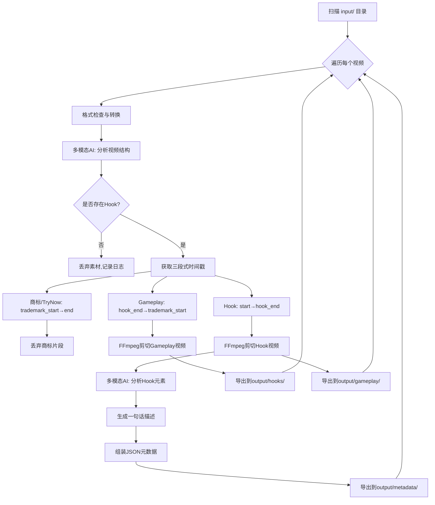
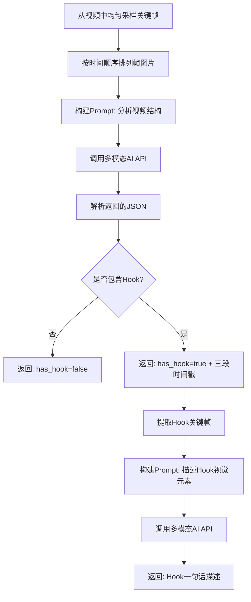

# 竞品广告素材分析工作流 V2 - 实现方案

## 1. 需求变更概述

从 V1 的"剪除商标"升级为完整的广告素材结构分析与拆分：

| 需求 | 说明 |
|------|------|
| Hook 检测 | 判断视频开头是否存在 hook（纯图像、无玩法的吸引点击片段） |
| 无 Hook 丢弃 | 不存在 hook 的素材直接丢弃 |
| 视频分段 | 存在 hook 的素材切分为：hook + 带hook元素的玩法展示 + 商标/try now |
| 商标去除 | 去除结尾的商标/try now 界面 |
| 拆分存档 | 将 hook 与 gameplay 拆分为两个独立视频 |
| Hook 分析 | 分析 hook 部分的视觉元素，总结成一句话，JSON 存储 |

## 2. 视频结构模型

```
典型竞品广告素材结构：

┌──────────┬──────────────────────────────┬──────────────┐
│   Hook    │     Gameplay（玩法展示）      │  商标/Try Now │
│  纯图像   │  带hook元素的玩法演示          │   结尾画面    │
│  几秒钟   │  几十秒                       │   几秒       │
└──────────┴──────────────────────────────┴──────────────┘
     ↓                    ↓                     ↓
  保存为hook视频     保存为gameplay视频        丢弃

输出：
  output/hooks/{stem}_hook.mp4        ← hook 视频
  output/gameplay/{stem}_gameplay.mp4 ← gameplay 视频
  output/metadata/{stem}.json         ← 结构化描述
```

## 3. 技术选型变更

| 模块 | V1 方案 | V2 方案 | 变更原因 |
|------|---------|---------|---------|
| Hook 检测 | 无 | 多模态AI模型 | 需要语义理解判断是否为hook |
| 商标检测 | YOLOv8 | YOLOv8 + 多模态AI | YOLO检测已知商标，AI检测try now等结尾画面 |
| Hook 分析 | 无 | 多模态AI模型 | 需要图像理解能力 |
| 视频分段 | 简单剪切 | 结构化分段 | 需要三段式切分 |
| 输出 | 单视频 | hook+gameplay+JSON | 需要拆分存档 |

**多模态AI模型选择：**
- **OpenAI GPT-4o**：视觉理解能力强，API 稳定
- **Anthropic Claude Vision**：长上下文，细节描述好
- **开源模型（Qwen-VL/LLaVA）**：本地部署，无API费用

设计为可插拔架构，通过配置切换模型提供商。

## 4. 新工作流架构

### 4.1 处理流程图



### 4.2 多模态AI分析流程



### 4.3 项目目录结构变更

```
Videoprecut/
├── input/                        # 输入视频目录
├── output/
│   ├── hooks/                    # Hook 视频输出
│   ├── gameplay/                 # Gameplay 视频输出
│   └── metadata/                 # JSON 元数据输出
├── src/
│   ├── __init__.py
│   ├── main.py                   # 主入口 - V2工作流编排
│   ├── config.py                 # 全局配置（新增AI配置）
│   ├── ingestion.py              # 视频读取与格式检查（不变）
│   ├── converter.py              # 视频格式转换（不变）
│   ├── analyzer.py               # 🆕 多模态AI分析器
│   ├── structurer.py             # 🆕 视频结构分析（hook/gameplay/商标分段）
│   ├── detector.py               # YOLO商标检测（保留，用于精确商标定位）
│   ├── segmenter.py              # 片段分析（保留，逻辑调整）
│   ├── editor.py                 # 视频剪辑（保留，新增分段导出）
│   ├── parallel.py               # 多进程并行处理（调整）
│   ├── trainer.py                # YOLO模型训练（不变）
│   └── utils.py                  # 工具函数（新增帧采样）
├── models/
│   ├── dataset/                  # YOLO训练数据集
│   └── weights/                  # 模型权重
├── trademarks/                   # 商标样本
├── logs/                         # 日志
├── requirements.txt              # 新增 openai/anthropic 依赖
└── README.md
```

## 5. 新增模块详细设计

### 5.1 多模态AI分析器 - `analyzer.py`

**职责：** 封装多模态AI模型调用，提供视频结构分析和Hook元素描述

```python
# 核心接口
class MultimodalAnalyzer:
    def analyze_video_structure(self, frames: list[Image], fps: float) -> VideoStructure:
        """分析视频结构，返回 hook/gameplay/商标 三段时间戳"""
        
    def describe_hook(self, hook_frames: list[Image]) -> str:
        """分析Hook视觉元素，返回一句话描述"""

# 视频结构结果
@dataclass
class VideoStructure:
    has_hook: bool
    hook_end_time: float       # hook结束时间（秒）
    trademark_start_time: float # 商标开始时间（秒）
    confidence: float           # 分析置信度
```

**Prompt 设计 - 视频结构分析：**
```
你是一个广告视频分析专家。请分析以下视频帧（按时间顺序排列），
判断视频的结构：

1. 视频开头是否存在"Hook"片段？（Hook是指纯图像、无游戏玩法展示、
   用于吸引点击的开头片段，通常几秒钟）
2. 如果存在Hook，Hook在哪个时间点结束？
3. 视频结尾是否存在商标/logo/"Try Now"等结束画面？从哪个时间点开始？

请以JSON格式返回：
{
    "has_hook": true/false,
    "hook_end_seconds": 数字,
    "trademark_start_seconds": 数字,
    "confidence": 0.0-1.0
}
```

**Prompt 设计 - Hook元素描述：**
```
请用一句话描述这个广告Hook片段的视觉元素和吸引点。
例如："一只卡通猫咪在彩色障碍赛道上奔跑" 
或"金币从天而降的炫酷特效画面"
只返回一句话，不要额外解释。
```

**模型提供商抽象：**

```python
class AIProvider(ABC):
    @abstractmethod
    def analyze_images(self, images: list, prompt: str) -> str: ...

class OpenAIProvider(AIProvider): ...     # GPT-4o
class AnthropicProvider(AIProvider): ...   # Claude Vision  
class LocalProvider(AIProvider): ...       # Qwen-VL / LLaVA
```

### 5.2 视频结构分析模块 - `structurer.py`

**职责：** 整合多模态AI和YOLO检测结果，确定最终的视频分段

```python
@dataclass
class VideoStructureResult:
    has_hook: bool                          # 是否存在Hook
    hook_segment: TimeSegment               # Hook时间段
    gameplay_segment: TimeSegment           # Gameplay时间段
    trademark_segment: TimeSegment | None   # 商标时间段（可能为空）
    hook_description: str                   # Hook一句话描述
    should_discard: bool                    # 是否应丢弃（无Hook）
```

**分段策略：**
1. 先用多模态AI分析视频整体结构，获取 hook_end 和 trademark_start
2. 再用 YOLO 精确定位商标帧，微调 trademark_start 时间戳
3. 如果 AI 和 YOLO 结果冲突，以 YOLO 为准（商标检测更精确）
4. 如果 AI 判断无 Hook，直接标记为丢弃

### 5.3 配置变更 - `config.py`

新增配置项：

```python
# 多模态AI配置
ai_provider: str = "openai"          # AI提供商: openai/anthropic/local
ai_api_key: str = ""                 # API密钥
ai_model: str = "gpt-4o"            # 模型名称
ai_base_url: str = ""                # 自定义API地址（可选）
ai_max_tokens: int = 1024            # 最大生成token数
ai_temperature: float = 0.3          # 生成温度

# 视频结构分析配置
frame_sample_count: int = 8          # 结构分析采样帧数
hook_max_duration: float = 10.0      # Hook最大时长（秒）
hook_description_enabled: bool = True # 是否启用Hook描述

# 输出配置
output_hooks_dir: str = "output/hooks"
output_gameplay_dir: str = "output/gameplay"  
output_metadata_dir: str = "output/metadata"
```

### 5.4 JSON 元数据格式

```json
{
    "filename": "0a9be9a96041a462dbf06e0cd2db0043.mp4",
    "has_hook": true,
    "hook_description": "一只卡通猫咪在彩色障碍赛道上奔跑的炫酷画面",
    "segments": {
        "hook": {
            "start": 0.0,
            "end": 3.5,
            "duration": 3.5
        },
        "gameplay": {
            "start": 3.5,
            "end": 28.7,
            "duration": 25.2
        },
        "trademark": {
            "start": 28.7,
            "end": 30.8,
            "duration": 2.1
        }
    },
    "video_info": {
        "width": 1080,
        "height": 1920,
        "fps": 30.0,
        "total_duration": 30.8
    },
    "processing_time": 12.5
}
```

## 6. 主工作流变更 - `main.py`

```python
def process_video(video, config):
    # 1. 格式检查与转换
    mp4_path = ensure_mp4(video, config)
    
    # 2. 采样关键帧
    frames = sample_keyframes(mp4_path, config.frame_sample_count)
    
    # 3. 多模态AI分析视频结构
    analyzer = MultimodalAnalyzer(config)
    structure = analyzer.analyze_video_structure(frames, video.fps)
    
    # 4. 判断是否存在Hook
    if not structure.has_hook:
        logger.info(f"无Hook，丢弃: {video.filename}")
        return {"discarded": True, "reason": "no_hook"}
    
    # 5. YOLO精确定位商标（可选，微调trademark_start）
    if config.model_weights存在:
        detection = detector.detect_video(mp4_path)
        微调structure.trademark_start
    
    # 6. 组装最终分段
    result = VideoStructureResult(
        hook_segment = TimeSegment(0, structure.hook_end_time),
        gameplay_segment = TimeSegment(structure.hook_end_time, structure.trademark_start_time),
        trademark_segment = TimeSegment(structure.trademark_start_time, video.duration),
    )
    
    # 7. 剪切Hook视频
    edit_video(mp4_path, result.hook_segment, output_hooks_dir, config)
    
    # 8. 剪切Gameplay视频
    edit_video(mp4_path, result.gameplay_segment, output_gameplay_dir, config)
    
    # 9. 分析Hook元素
    hook_frames = extract_segment_frames(mp4_path, result.hook_segment)
    description = analyzer.describe_hook(hook_frames)
    
    # 10. 生成JSON元数据
    save_metadata(video, result, description, output_metadata_dir)
```

## 7. 依赖变更

```
# requirements.txt 新增
openai>=1.0.0            # OpenAI GPT-4o API（可选）
anthropic>=0.20.0        # Claude Vision API（可选）
```

## 8. 边界情况处理

| 场景 | 处理方式 |
|------|---------|
| 无Hook | 丢弃，记录到日志和JSON |
| 整个视频都是Hook | 丢弃（无gameplay无价值） |
| 无商标结尾 | gameplay延伸到视频末尾 |
| Hook和Gameplay边界模糊 | AI返回置信度，低置信度时取Hook最大时长 |
| AI API调用失败 | 回退到YOLO-only模式（仅商标检测） |
| AI返回时间戳异常 | 校验：hook_end < trademark_start < duration |
| 视频极短（<5s） | 可能无完整结构，标记为丢弃 |
